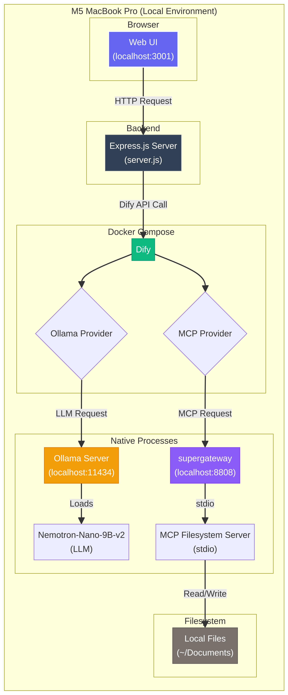

# ローカルAIエージェント on M5 Mac

**MacBook Pro (M5, 24GB) 上で、完全にローカルで完結するAIエージェントアプリケーションです。**

Dify、Ollama、MCP (Model Context Protocol) を組み合わせ、インターネット接続なしでファイルの読み書き、要約、議事録作成、チャットなどが可能な環境を構築します。モデルには日本語性能の高い `NVIDIA/Nemotron-Nano-9B-v2-Japanese` を採用しています。

---

## ✨ 主な機能

- **完全ローカル動作**: インターネット接続不要。機密性の高い情報も安心して扱えます。
- **ファイル操作エージェント**: ローカルファイルシステムと連携し、ファイルの読み書き、検索、一覧表示などを自律的に実行します。
- **高品質な議事録作成**: 長文の文字起こしを自動で分割・要約し、手書きメモと統合して、構造化された議事録を生成します。
- **動的なWebインターフェース**: チャットモードと議事録作成モードを切り替え可能な、使いやすいカスタムUIを提供します。
- **自動セットアップ**: 面倒な環境構築をシェルスクリプト一本で自動化します。

## 🏛️ アーキテクチャ

このアプリケーションは、以下のコンポーネントが連携して動作します。



| コンポーネント | 役割 |
| :--- | :--- |
| **Web UI** | ユーザーとの対話を行うカスタムフロントエンド。Dify APIを呼び出す。 |
| **Express.js Server** | Web UIとDify APIを仲介するプロキシサーバー。CORSを回避。 |
| **Dify** | ワークフローとエージェントの実行基盤。LLMやツールを統合管理。 |
| **Ollama** | ローカル環境でLLMを動作させるためのサーバー。 |
| **Nemotron-Nano-9B-v2** | 今回使用する日本語LLM。 |
| **MCP Filesystem Server** | Difyエージェントがローカルファイルを操作するためのツール。 |
| **supergateway** | MCPサーバーのstdioインターフェースをHTTP/SSEに変換するプロキシ。 |

## 📂 ファイル構成

納品物（`dify-local-agent.zip`）を展開すると、以下のファイルが配置されます。

```
.dify-local-agent/
├── README.md                # このドキュメント
├── architecture.mmd         # アーキテクチャ図 (Mermaidソース)
├── architecture.png         # アーキテクチャ図 (画像)
├── config/
│   └── Modelfile            # Ollamaカスタムモデル設定
├── dsl/
│   ├── agent_workflow.yml   # ファイル操作エージェントのDSL
│   └── minutes_workflow.yml # 議事録作成ワークフローのDSL
├── frontend/
│   ├── public/
│   │   └── index.html       # Web UIのHTML
│   ├── package.json         # Node.js設定
│   └── server.js            # Expressバックエンド
└── scripts/
    ├── setup.sh             # 初期セットアップスクリプト
    ├── start-all.sh         # 全サービス起動スクリプト
    └── stop-all.sh          # 全サービス停止スクリプト
```

## 🚀 セットアップ手順

**約15〜30分で完了します。**

### 1. 前提条件

以下のソフトウェアがMacにインストールされている必要があります。

- **Homebrew**: macOS用パッケージマネージャー。
- **Docker Desktop**: コンテナ実行環境。必ず**起動した状態**にしてください。

`setup.sh`スクリプトがHomebrewのインストールを試みますが、手動での事前インストールを推奨します。

### 2. セットアップスクリプトの実行

ターミナルを開き、ダウンロードした `dify-local-agent` ディレクトリに移動して、以下のコマンドを実行します。

```bash
cd path/to/dify-local-agent
chmod +x scripts/*.sh
./scripts/setup.sh
```

このスクリプトは、以下の処理を自動的に行います。

1.  **前提条件のチェック** (Docker, Node.js, Git)
2.  **Ollamaのインストール**と**LLMモデルのダウンロード** (~7GB)
3.  **Difyリポジトリのクローン**と**Dockerコンテナの起動**
4.  **MCP Filesystem Serverのセットアップ**
5.  **カスタムフロントエンドの依存関係インストール**

### 3. Difyの初期設定

スクリプト完了後、いくつかの手動設定が必要です。

1.  **Dify管理者アカウント作成**
    - ブラウザで **http://localhost/install** を開きます。
    - 画面の指示に従い、管理者アカウントを作成します。

2.  **OllamaをDifyに接続**
    - Difyにログイン後、`設定` > `モデルプロバイダー` > `Ollama` を選択します。
    - `追加`ボタンを押し、以下の通り設定します。
      - **Model Name**: `hf.co/mmnga-o/NVIDIA-Nemotron-Nano-9B-v2-Japanese-gguf:Q5_K_M`
      - **Base URL**: `http://host.docker.internal:11434`
    - `保存`をクリックします。

3.  **MCP Filesystem ServerをDifyに接続**
    - Difyで `ツール` > `MCP` > `Add MCP Server (HTTP)` をクリックします。
    - 以下の通り設定します。
      - **Server URL**: `http://host.docker.internal:8808/sse`
      - **Name**: `Local Filesystem` （任意）
      - **Server ID**: `local-fs` （任意ですが、一度決めたら変更しないでください）
    - `保存`をクリックします。

## 💻 利用方法

### 1. 全サービスの起動

ターミナルで以下のコマンドを実行すると、必要なサービスがすべてバックグラウンドで起動します。

```bash
./scripts/start-all.sh
```

- **起動するサービス**: Ollama, Dify, MCP Server, カスタムフロントエンド
- **ログファイル**: `logs/` ディレクトリに各サービスのログが出力されます。

### 2. Web UIにアクセス

ブラウザで **http://localhost:3001** を開きます。

### 3. Dify APIキーの設定

Web UIを操作するには、Difyで作成したアプリのAPIキーが必要です。

1.  **Difyでアプリを作成**: `スタジオ` > `はじめから作成` で、`チャットボット` を作成します。
2.  **APIキーを取得**: 作成したアプリの `API` タブでAPIキーをコピーします。
3.  **Web UIに設定**: Web UIのサイドバーにある `Dify API Key` に貼り付けます。
    - `agent_workflow.yml` をインポートして使う場合は、そのアプリのAPIキーを `Dify API Key` に設定します。
    - `minutes_workflow.yml` をインポートして使う場合は、そのアプリのAPIキーを `ワークフロー API Key` に設定します。

### 4. ワークフローのインポート

提供されているDSLファイルをインポートすることで、すぐに高度な機能を利用できます。

- Difyで `スタジオ` > `アプリを作成` > `DSLファイルをインポート` を選択します。
- `dsl/agent_workflow.yml` または `dsl/minutes_workflow.yml` をアップロードします。
- インポート後、アプリの `API` タブからAPIキーを取得し、Web UIに設定してください。

### 5. サービスの停止

以下のコマンドで、Difyと関連プロセスをすべて停止します。

```bash
./scripts/stop-all.sh
```

**注意**: Ollama本体は自動で停止しません。必要に応じて手動で `pkill ollama` コマンドで停止してください。

---

以上で、あなたのMacが強力なローカルAIエージェント実行環境になります。
